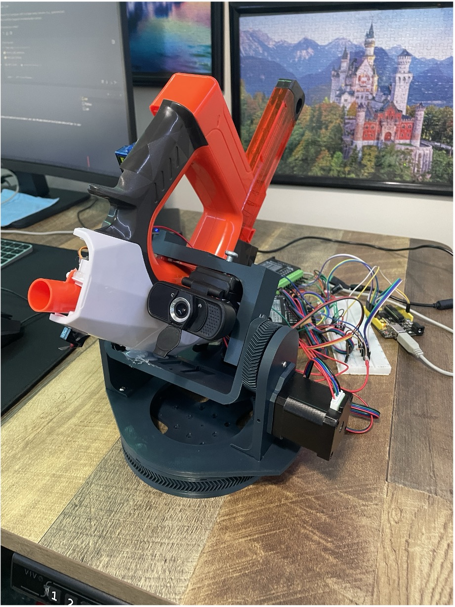
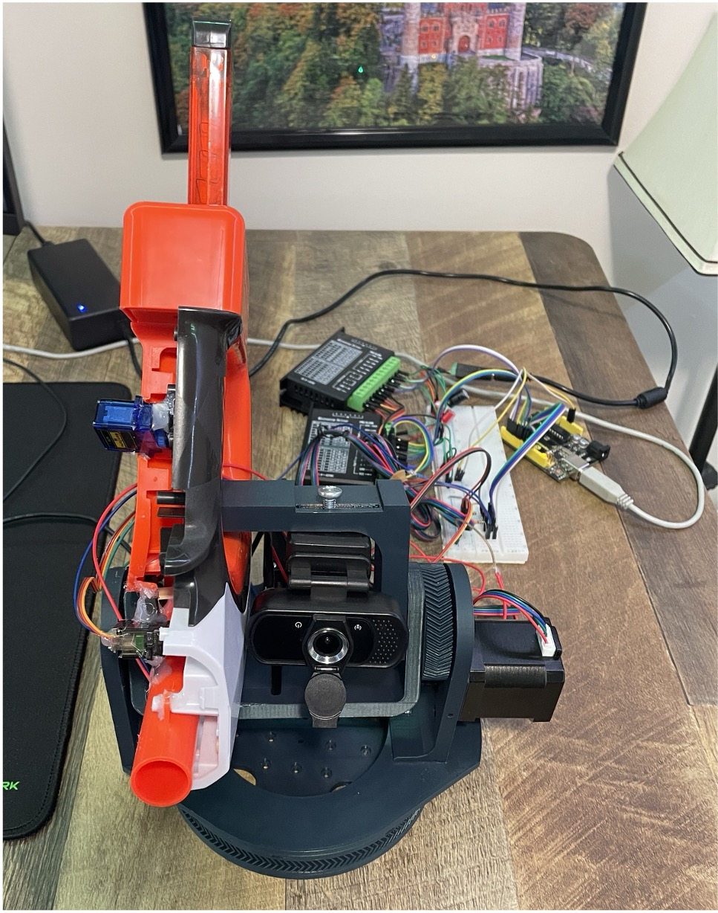
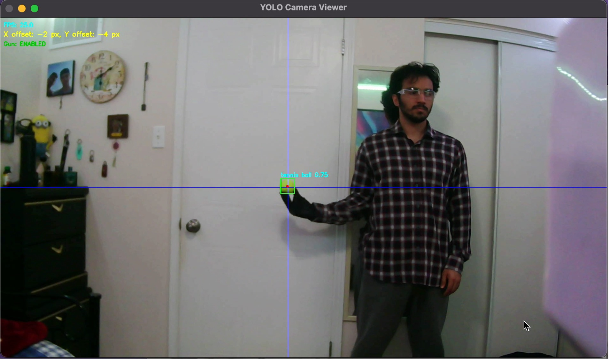
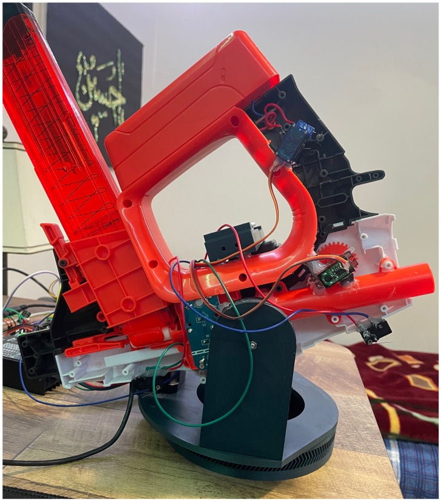
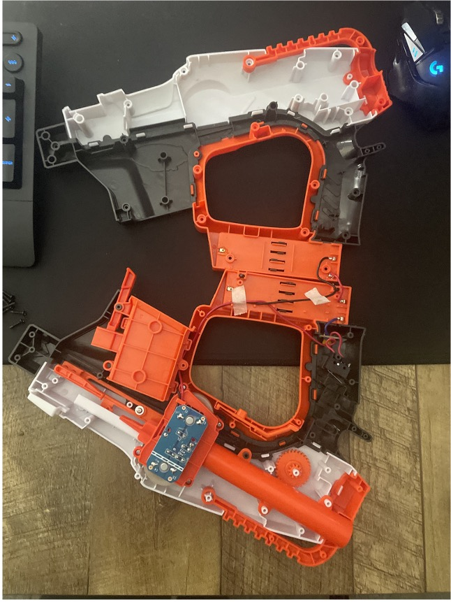
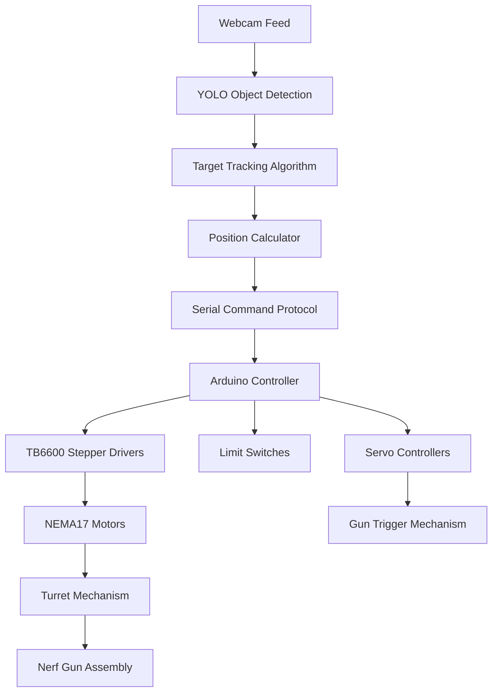

# 🎯 Autonomous Nerf Gun Turret

[](https://www.arduino.cc/)
[](https://www.python.org/)
[](https://ultralytics.com/)
[](https://opencv.org/)

> An intelligent mechatronic turret system that autonomously detects and engages targets using computer vision and precision servo control.

**🎬 [Watch Demo Video](https://youtu.be/Jn-dusm-H4Y)**



## Project Overview

This project demonstrates the integration of **computer vision**, **embedded systems**, and **mechanical engineering** to create an autonomous targeting system. The turret uses a custom-trained YOLO detector to identify objects (tennis balls) in real-time and precisely aims a modified nerf gun using high-precision stepper motors.

### Gallery

<div align="center">
  
  
</div>

<div align="center">
  
  
</div>

## Key Features

### Precision Targeting

- **High-accuracy positioning**: ±2.32 cm at 100m (yaw), ±6.44 cm (pitch)
- **1/16 microstepping** with gear reduction for ultra-smooth motion
- **NEMA17 stepper motors** with TB6600 drivers for reliable operation

### Intelligent Detection

- **Custom YOLO v8 model** trained for tennis ball detection
- **Real-time computer vision** processing at 30+ FPS
- **Adaptive targeting algorithms** with predictive aiming

### Robust Control System

- **5 Hz command loop** balancing responsiveness and reliability
- **Non-blocking Arduino firmware** for real-time execution
- **Absolute positioning** with limit switch homing
- **Serial command protocol** for seamless PC-Arduino communication

### Professional Implementation

- **Embedded C++** firmware with state machine architecture
- **Python control system** using OpenCV and Ultralytics YOLO
- **Modular design** for easy expansion and maintenance

## System Architecture



## Hardware Components

| Component           | Specification      | Purpose               |
| ------------------- | ------------------ | --------------------- |
| **Microcontroller** | Arduino UNO R3     | Main control unit     |
| **Stepper Motors**  | NEMA17 (1.8°/step) | Precision positioning |
| **Motor Drivers**   | TB6600 Microstep   | Smooth motion control |
| **Camera**          | USB Webcam (720p)  | Target detection      |
| **Servos**          | SG90 Micro Servos  | Gun trigger mechanism |
| **Sensors**         | Limit Switches     | Homing and safety     |
| **Power Supply**    | 12V 5A DC          | Motor power           |

## Software Stack

### **Computer Vision Pipeline**

- **YOLOv8 Nano** - Custom trained model for tennis ball detection
- **OpenCV** - Image processing and camera interface
- **Ultralytics** - Deep learning inference framework

### **Embedded Firmware**

- **Arduino C++** - Real-time motor control
- **Non-blocking architecture** - Maintains responsiveness
- **State machine design** - Robust command processing

### **Control System**

- **Python 3.x** - Main control application
- **Serial communication** - Robust command protocol
- **Threading** - Parallel processing for optimal performance

## Technical Specifications

### **Positioning Accuracy**

- **Horizontal Resolution**: 50 pulses/degree (1280 steps/17°)
- **Vertical Resolution**: 10 pulses/degree (5120 steps/189°)
- **Field of View**: 70° horizontal × 52° vertical
- **Targeting Precision**: <3 cm at 100m range

### **Performance Metrics**

- **Detection Rate**: 30+ FPS
- **Command Frequency**: 5 Hz control loop
- **Response Time**: <200ms target acquisition
- **Reload Cycle**: 400ms between shots

## Quick Start

### Prerequisites

```bash
# Python dependencies
pip install ultralytics opencv-python pyserial

# Arduino libraries
# - Servo library (included in Arduino IDE)
# - Custom stepper control implementation
```

### Running the System

1. **Upload Arduino firmware**:

   ```bash
   # Using PlatformIO
   cd ArduinoStepper
   pio run --target upload
   ```

2. **Start the detection system**:

   ```bash
   # Basic operation
   python3 tennis_ball_demo.py

   # High-performance mode (Apple Silicon)
   python3 tennis_ball_demo.py -d mps --half

   # Optimized for speed
   python3 tennis_ball_demo.py --imgsz 416 --skip 2
   ```

## Project Structure

```
autonomous_nerf_turret/
├── 📄 tennis_ball_demo.py      # Main Python control application
├── 🔧 ArduinoStepper/          # Arduino firmware
│   ├── src/main.cpp            # Main control logic
│   ├── include/main.h          # Pin definitions & constants
│   └── platformio.ini          # Build configuration
├── 🖼️ Assets/                   # Project documentation images
└── 📚 README.md                # This file
```

## Key Achievements

- ✅ **Designed and built** embedded mechatronic turret integrating webcam, custom YOLO detector, and Arduino-controlled NEMA17 steppers
- ✅ **Implemented robust real-time** serial command protocol and non-blocking Arduino firmware
- ✅ **Engineered PC to Arduino** control loop at 5 Hz for optimal responsiveness
- ✅ **Achieved high positional precision** using 1/16 microstepping and gear reduction

## Configuration

### Camera Settings

```python
HORIZONTAL_FOV = 70.0  # degrees
VERTICAL_FOV = 52.0    # degrees
```

### Motor Calibration

```cpp
const int STEPS_PER_REV = 3200;           // 1/16 microstepping
const int YAW_PULSES_PER_DEGREE = 50;     # X-axis resolution
const int PITCH_PULSES_PER_DEGREE = 10;   # Y-axis resolution
```

### Serial Communication

```python
SERIAL_PORT = "/dev/cu.usbmodem31201"
BAUD_RATE = 115200
```

## Safety Features

- **Limit switch protection** prevents mechanical damage
- **Software bounds checking** ensures safe operating range
- **Emergency stop capability** via serial commands
- **Gun enable/disable control** for safe operation

## Future Enhancements

- [ ] **Multi-target tracking** and prioritization
- [ ] **Predictive aiming** for moving targets
- [ ] **Wireless control interface** via WiFi/Bluetooth
- [ ] **Advanced computer vision** with depth estimation
- [ ] **Mobile app integration** for remote operation

---

<div align="center">
  <strong>Built with ❤️ for autonomous systems and computer vision</strong>
</div>
